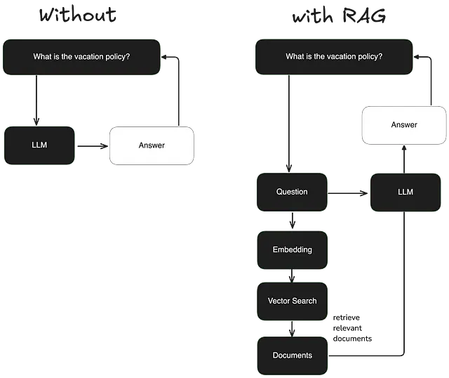
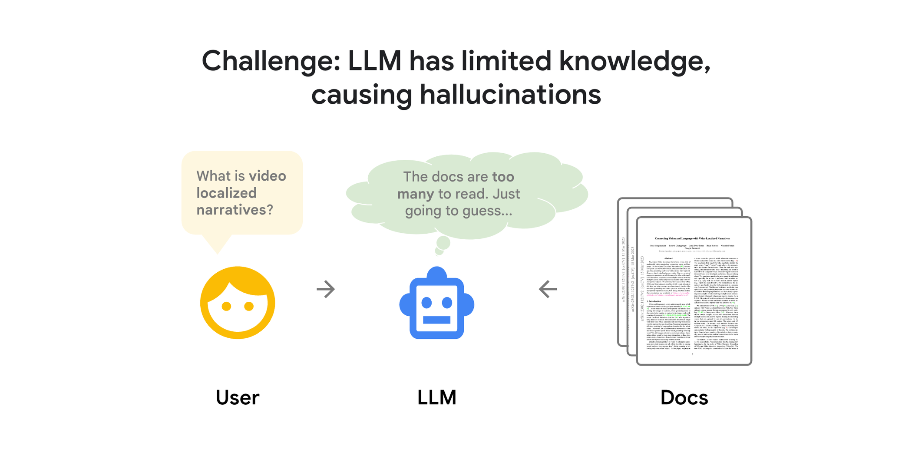
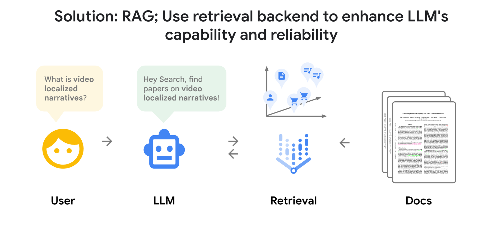

# Building a Retrieval-Augmented Generation (RAG) Bot

This guide demonstrates how to build a simple Retrieval-Augmented Generation (RAG) bot using Gradio and Hugging Face APIs, which enhances the performance of language models by incorporating external knowledge. The bot will retrieve relevant documents based on a user query and use them to generate more accurate and contextually relevant responses.






## How RAG Enhances LLM Performance

RAG improves the performance of language models by augmenting them with external documents. When a user poses a query, the RAG system retrieves relevant documents from a pre-indexed knowledge base and combines them with the original query before passing them to the language model for response generation. This approach allows the model to access up-to-date and domain-specific information without the need for extensive retraining.

## Key Steps in RAG

1. **Input**: The user's query is provided as input. Without RAG, the language model directly processes the query. With RAG, the query is enriched by retrieving relevant documents.
   
2. **Indexing**: Documents are indexed by chunking, embedding the chunks, and storing them in a vector store. The query is also embedded in a similar way during inference.

3. **Retrieval**: The system retrieves relevant documents by comparing the query embedding against the indexed vectors.

4. **Generation**: The retrieved documents are combined with the original prompt and passed to the language model to generate the response.

## Use Case

For example, a user might ask a question that the model alone cannot answer due to a lack of knowledge of current events. By using RAG, the system retrieves the relevant information from indexed documents to provide an accurate response.

## Ingredients for Building the Bot

- **Knowledgebase**: A PDF document containing the information you want to use for your chatbot's knowledge.
- **requirements.txt**: A file listing the necessary dependencies.
- **app.py**: The main Python file for building the RAG chatbot.
- **Hugging Face Account**: Required to access the Hugging Face model for response generation.

## Step-by-Step Guide

### 1. Create the `requirements.txt` File

Include the following dependencies:

```
gradio
huggingface_hub
PyMuPDF
sentence-transformers
faiss-cpu
```

### 2. Create the `app.py` File

This file contains the logic for loading the PDF, indexing documents, and building the RAG system. The following steps are implemented in `app.py`:

- **Initialize the app and load PDF**: Extracts text from a PDF document and stores it in the app’s memory.
  
- **Build a vector database**: Generates embeddings for the document content using the Sentence-Transformer model and stores them in a FAISS index for efficient similarity search.

- **Search function**: Searches for relevant documents by comparing the query’s embedding against the indexed documents.

- **Response generation**: Uses the retrieved documents to generate a response using a language model from Hugging Face.

### 3. Create the Gradio Interface

The Gradio interface allows users to interact with the RAG bot. The bot is presented as a chatbot that can respond to user queries by combining relevant document content with the model's response.

### 4. Run the Bot

Launch the bot using Gradio to provide a user-friendly interaction. The bot will be capable of answering questions based on the content extracted from the PDF document.

## Limitations of Naive RAG and How to Improve It

While the basic RAG approach is effective, there are some limitations:

- **Low Precision and Recall**: Sometimes the retrieved documents may not be perfectly aligned with the query, leading to irrelevant or inaccurate information.
  
- **Outdated Information**: If the indexed documents contain outdated content, the responses may not be fully accurate.

- **Redundancy and Repetition**: Multiple retrieved documents may contain similar information, leading to verbose responses.

### Advanced RAG Techniques to Improve Performance

- **Pre-Retrieval Optimization**: Enhance the quality of indexed data by improving granularity and metadata.
  
- **Retrieval Optimization**: Fine-tune embedding models to better capture context and relevance.

- **Post-Retrieval Optimization**: Re-rank the retrieved documents and apply techniques to prioritize the most relevant information.

By using these advanced techniques, the performance and accuracy of the RAG system can be significantly improved.

## Conclusion

Building a RAG bot enhances a language model’s ability to generate contextually relevant responses by incorporating external knowledge. This approach can be applied to various domains, making it a powerful tool for creating intelligent and accurate chatbots.